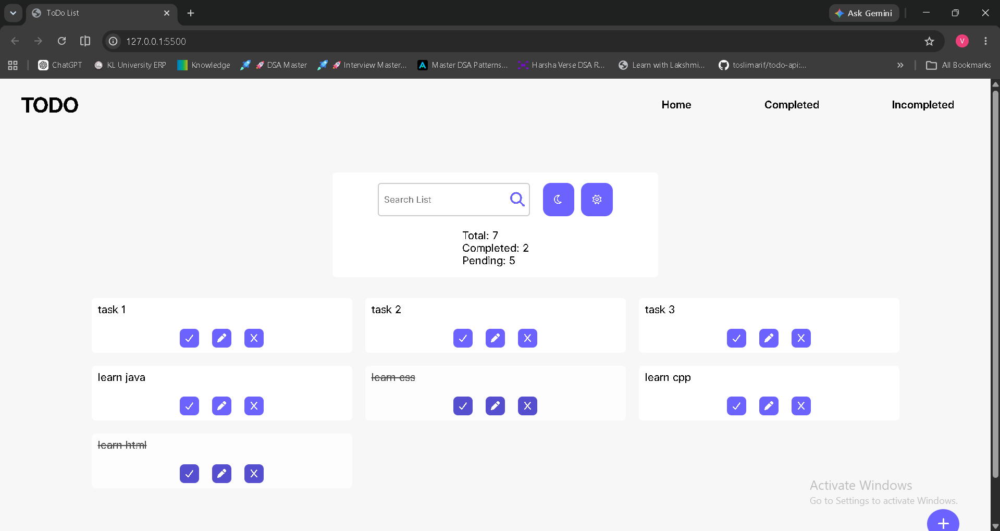

# TODO List Project

This is a completed responsive Todo List application built with HTML, CSS, and vanilla JavaScript. It supports full task management, filtering, counters, and persistent user preferences.

## Project Highlights

- Full CRUD support (Create, Read, Update, Delete)
- Search tasks in real time
- Filter tasks by status
- Task counters (Total, Completed, Pending)
- Event delegation for efficient action handling
- Local storage support for task persistence
- Theme switching (light and dark)
- Theme persistence after page refresh
- Reusable JavaScript functions for cleaner structure
- Responsive layout for desktop and mobile

## Tech Stack

- HTML5
- CSS3
- Vanilla JavaScript
- Font Awesome
- Google Fonts

## Project Structure

- `index.html` - main page structure
- `style.css` - styling, responsive layout, and theme-related UI styles
- `index.js` - app logic for CRUD, search, filters, counters, local storage, and theme persistence

## How To Run The Project

1. Clone the repository from GitHub.
2. Open the project folder in VS Code.
3. Open `index.html` directly in your browser,
   or run it using the Live Server extension.
4. Add, edit, delete, search, and filter tasks.
5. Refresh the page to verify task and theme persistence.

## Demo

- App Screenshot

- Task Flow GIF (CRUD + Filters + Search): add your GIF link here
- Theme Toggle Demo: add your short video/GIF link here

## Core Features

- Create tasks
- Read and display tasks
- Update task text
- Delete tasks
- Mark tasks as completed
- Search tasks
- Filter tasks
- Show total/completed/pending counters
- Persist tasks in local storage
- Switch themes
- Persist theme preference

## Status

Project completed as Day-6 milestone in the learning journey.
